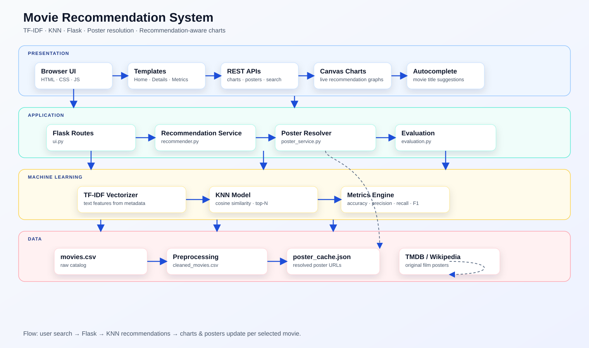

# Cinephile World - Movie Recommendation System

Cinephile World is a Flask-based AI Lab project that recommends similar movies with one focused K-Nearest Neighbors model. The model uses TF-IDF movie metadata features and returns nearest movies from the catalog.

## Features

- Professional Flask movie recommendation GUI
- KNN-only recommendation model
- TF-IDF feature extraction from title, synopsis, cast, genre, language, and region
- Correct known poster URLs plus neutral title-card fallbacks for unknown catalog rows
- No random placeholder photos used as movie posters
- Stable train/test evaluation with fixed random state
- Accuracy, Precision, Recall, F1-score, cross-validation mean and standard deviation
- Deterministic browser charts rendered with JavaScript canvas code
- Live autocomplete search
- Filters for genre, region, year, language, and rating
- Movie details page with 10 KNN recommendations
- Professional SVG architecture diagram

## Technologies

- Python
- Flask
- Pandas
- NumPy
- Scikit-learn
- Matplotlib
- HTML, CSS, JavaScript

## Dataset

The app uses `data/movies.csv` and writes cleaned output to `data/cleaned_movies.csv`.

Expected columns:

`title`, `poster`, `synopsis`, `cast`, `genre`, `release_year`, `rating`, `language`, `runtime`, `region`

Known movies use verified poster URLs. Unknown or synthetic catalog rows use generated title-card posters so the GUI does not show incorrect random images.

To refresh the whole catalog with real TMDB posters, set `TMDB_API_KEY` and run:

```bash
python refresh_posters.py
```

## Machine Learning Workflow

1. Load movie metadata from CSV.
2. Clean missing values and duplicate rows.
3. Correct poster URLs during preprocessing.
4. Combine metadata into one text feature.
5. Convert text into TF-IDF vectors.
6. Train `NearestNeighbors` KNN with cosine distance.
7. Return the nearest movies for the selected title.

## Architecture



```text
Browser GUI
   -> Flask routes in ui.py
   -> MovieRecommendationService in recommender.py
   -> KNNRecommender in model.py
   -> MoviePreprocessor in preprocess.py
   -> CSV data, charts, and metrics
```

## Project Structure

```text
movie_recommendation_system/
├── data/
│   ├── movies.csv
│   └── cleaned_movies.csv
├── static/
│   ├── css/style.css
│   └── js/app.js
├── templates/
│   ├── index.html
│   ├── movie_details.html
│   └── metrics.html
├── charts/
├── screenshots/
├── main.py
├── model.py
├── ui.py
├── preprocess.py
├── recommender.py
├── evaluation.py
├── utils.py
├── requirements.txt
├── README.md
└── architecture.svg
```

## Installation

```bash
pip install -r requirements.txt
```

## Run

```bash
python main.py
```

Open:

```text
http://127.0.0.1:5000
```

## Charts

The Metrics page renders charts with JavaScript canvas code from `/api/chart-data`.
The chart data should not change between runs unless the dataset or KNN settings are changed.
